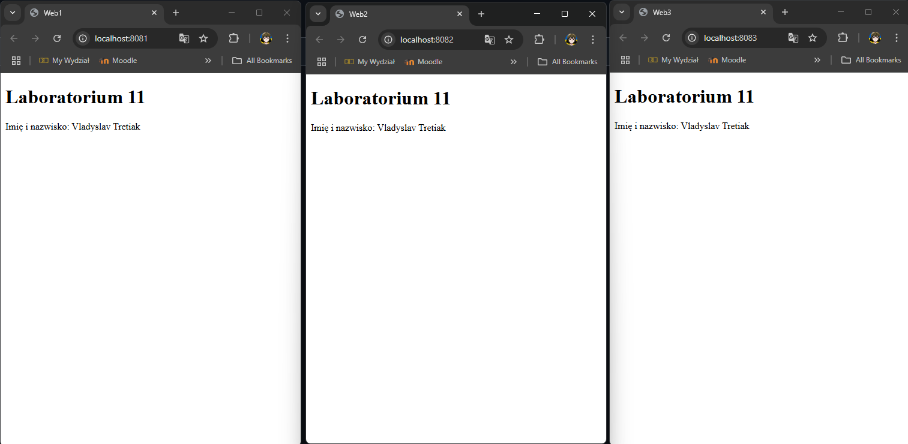
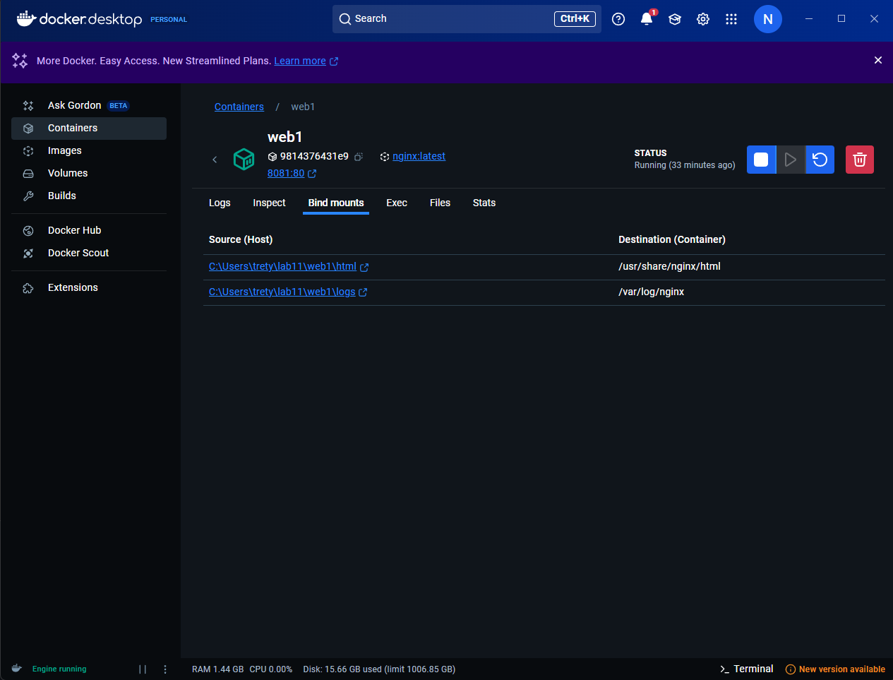

# Lab 11

## 📋 Cel zadania

Uruchomić trzy kontenery Docker z serwerem `nginx:latest`, w taki sposób, aby:

* wszystkie kontenery były podłączone do jednej mostkowej sieci użytkownika (`lab11net`),
* serwery były dostępne z poziomu przeglądarki na komputerze lokalnym,
* każdy serwer wyświetlał prostą stronę HTML z numerem laboratorium i imieniem i nazwiskiem studenta (HTML z wolumenów `read-only`),
* logi z każdego serwera były zapisywane w osobnych katalogach lokalnych (`read-write`) w strukturze `~/lab11`.

---
### 1. Stworzenie sieci Docker

```bash
docker network create --driver bridge lab11net
```

Tworzy mostkową sieć `lab11net`, do której będą podłączone wszystkie kontenery (`web1`, `web2`, `web3`).

---

### 2. Struktura katalogów

W katalogu domowym (`${HOME}` lub `C:\Users\Username`) tworzymy następującą strukturę:

```
lab11/
├── web1/
│   ├── html/
│   │   └── index.html
│   └── logs/
├── web2/
│   ├── html/
│   │   └── index.html
│   └── logs/
└── web3/
    ├── html/
    │   └── index.html
    └── logs/
```

#### Przykład pliku `index.html`

```html
<!DOCTYPE html>
<html>
  <head><title>Web1</title></head>
  <body>
    <h1>Laboratorium 11</h1>
    <p>Imię i nazwisko: Vladyslav Tretiak</p>
  </body>
</html>
```

---

### 3. Uruchomienie kontenerów

Dla każdego kontenera uruchamiamy polecenie `docker run`:

#### Web1:

```bash
docker run -d --name web1 `
  --network lab11net `
  -p 8081:80 `
  -v ${HOME}\lab11\web1\html:/usr/share/nginx/html:ro `
  -v ${HOME}\lab11\web1\logs:/var/log/nginx `
  nginx:latest
```

#### Web2:

```bash
docker run -d --name web3 `
  --network lab11net `
  -p 8083:80 `
  -v ${HOME}\lab11\web3\html:/usr/share/nginx/html:ro `
  -v ${HOME}\lab11\web3\logs:/var/log/nginx `
  nginx:latest
```

#### Web3:

```bash
docker run -d --name web2 `
  --network lab11net `
  -p 8082:80 `
  -v ${HOME}\lab11\web2\html:/usr/share/nginx/html:ro `
  -v ${HOME}\lab11\web2\logs:/var/log/nginx `
  nginx:latest
```

---

## Sprawdzenie:

Polecenie do sprawdzenia utworzonej sieci:

```bash
docker network inspect lab11net
```

Wynik:

```bash
[
    {
        "Name": "lab11net",
        "Id": "c264300d8676c29a1cfce4f9ec5474a9c9d3b19af7f2bd6f588a9db46aff70fb",
        "Created": "2025-05-25T17:26:55.965565347Z",
        "Scope": "local",
        "Driver": "bridge",
        "EnableIPv4": true,
        "EnableIPv6": false,
        "IPAM": {
            "Driver": "default",
            "Options": {},
            "Config": [
                {
                    "Subnet": "172.20.0.0/16",
                    "Gateway": "172.20.0.1"
                }
            ]
        },
        "Internal": false,
        "Attachable": false,
        "Ingress": false,
        "ConfigFrom": {
            "Network": ""
        },
        "ConfigOnly": false,
        "Containers": {
            "2fd4f3e6ea348c242d82959f3f4ed242a17f111b46557dafc8106dc276d8cc31": {
                "Name": "web3",
                "EndpointID": "5b393a9624cd5eb28bef69b9490e71ad99f58f6ae49941d8a1c9056d0d75f751",
                "MacAddress": "9e:ea:6d:70:fe:8d",
                "IPv4Address": "172.20.0.4/16",
                "IPv6Address": ""
            },
            "9814376431e93afe03170a51cf6dcc80b375eaff01545bd168b66ec6278ce461": {
                "Name": "web1",
                "EndpointID": "cd25602ce7c1facd25d282391522999778d830d7695c75e4c8ce823549f1956e",
                "MacAddress": "8e:0a:68:11:b4:b9",
                "IPv4Address": "172.20.0.2/16",
                "IPv6Address": ""
            },
            "c635a1bb6c6463d9980e01397c244fc0985e3ac6ceae0af2d3de62f7ac4075a8": {
                "Name": "web2",
                "EndpointID": "5cadb5bdaab3a3ea04822d2390d34797b7163cb07761f7c6d55b7d819526a946",
                "MacAddress": "ba:91:9e:b2:d0:4e",
                "IPv4Address": "172.20.0.3/16",
                "IPv6Address": ""
            }
        },
        "Options": {},
        "Labels": {}
    }
]
```

Sprawdzenie, czy logi są zapisywane na hoście:

```bash
Get-Content "$HOME\lab11\web1\logs\access.log"
Get-Content "$HOME\lab11\web2\logs\access.log"
Get-Content "$HOME\lab11\web3\logs\access.log"
```

Wynik:

```bash
PS C:\Users\trety\lab11> Get-Content "$HOME\lab11\web1\logs\access.log"
172.20.0.1 - - [25/May/2025:17:31:36 +0000] "GET / HTTP/1.1" 200 167 "-" "Mozilla/5.0 (Windows NT 10.0; Win64; x64) AppleWebKit/537.36 (KHTML, like Gecko) Chrome/136.0.0.0 Safari/537.36" "-"
172.20.0.1 - - [25/May/2025:17:31:36 +0000] "GET /favicon.ico HTTP/1.1" 404 555 "http://localhost:8081/" "Mozilla/5.0 (Windows NT 10.0; Win64; x64) AppleWebKit/537.36 (KHTML, like Gecko) Chrome/136.0.0.0 Safari/537.36" "-"
172.20.0.1 - - [25/May/2025:17:33:58 +0000] "GET / HTTP/1.1" 200 209 "-" "Mozilla/5.0 (Windows NT 10.0; Win64; x64) AppleWebKit/537.36 (KHTML, like Gecko) Chrome/136.0.0.0 Safari/537.36" "-"
172.20.0.1 - - [25/May/2025:17:57:43 +0000] "GET / HTTP/1.1" 304 0 "-" "Mozilla/5.0 (Windows NT 10.0; Win64; x64) AppleWebKit/537.36 (KHTML, like Gecko) Chrome/136.0.0.0 Safari/537.36" "-"
PS C:\Users\trety\lab11> Get-Content "$HOME\lab11\web2\logs\access.log"
172.20.0.1 - - [25/May/2025:17:31:42 +0000] "GET / HTTP/1.1" 200 167 "-" "Mozilla/5.0 (Windows NT 10.0; Win64; x64) AppleWebKit/537.36 (KHTML, like Gecko) Chrome/136.0.0.0 Safari/537.36" "-"
172.20.0.1 - - [25/May/2025:17:31:43 +0000] "GET /favicon.ico HTTP/1.1" 404 555 "http://localhost:8082/" "Mozilla/5.0 (Windows NT 10.0; Win64; x64) AppleWebKit/537.36 (KHTML, like Gecko) Chrome/136.0.0.0 Safari/537.36" "-"
172.20.0.1 - - [25/May/2025:17:33:58 +0000] "GET / HTTP/1.1" 200 209 "-" "Mozilla/5.0 (Windows NT 10.0; Win64; x64) AppleWebKit/537.36 (KHTML, like Gecko) Chrome/136.0.0.0 Safari/537.36" "-"
172.20.0.1 - - [25/May/2025:17:57:42 +0000] "GET / HTTP/1.1" 304 0 "-" "Mozilla/5.0 (Windows NT 10.0; Win64; x64) AppleWebKit/537.36 (KHTML, like Gecko) Chrome/136.0.0.0 Safari/537.36" "-"
PS C:\Users\trety\lab11> Get-Content "$HOME\lab11\web3\logs\access.log"
172.20.0.1 - - [25/May/2025:17:33:53 +0000] "GET / HTTP/1.1" 200 209 "-" "Mozilla/5.0 (Windows NT 10.0; Win64; x64) AppleWebKit/537.36 (KHTML, like Gecko) Chrome/136.0.0.0 Safari/537.36" "-"
172.20.0.1 - - [25/May/2025:17:33:54 +0000] "GET /favicon.ico HTTP/1.1" 404 555 "http://localhost:8083/" "Mozilla/5.0 (Windows NT 10.0; Win64; x64) AppleWebKit/537.36 (KHTML, like Gecko) Chrome/136.0.0.0 Safari/537.36" "-"
172.20.0.1 - - [25/May/2025:17:57:42 +0000] "GET / HTTP/1.1" 304 0 "-" "Mozilla/5.0 (Windows NT 10.0; Win64; x64) AppleWebKit/537.36 (KHTML, like Gecko) Chrome/136.0.0.0 Safari/537.36" "-"
PS C:\Users\trety\lab11>
```

## 🌐 Dostępność w przeglądarce

Każdy kontener serwuje swoją stronę HTML przez przypisany port:

* Web1: [http://localhost:8081](http://localhost:8081)
* Web2: [http://localhost:8082](http://localhost:8082)
* Web3: [http://localhost:8083](http://localhost:8083)

Wynik: 



---

## 📆 Wolumeny

* `~/lab11/webX/html:/usr/share/nginx/html:ro` – HTML montowany jako **read-only**
* `~/lab11/webX/logs:/var/log/nginx` – logi montowane jako **read-write**



---

## ✅ Podsumowanie

Każdy kontener:

* korzysta z jednej wspólnej sieci (`lab11net`),
* udostępnia port HTTP do przeglądarki lokalnej,
* serwuje statyczną stronę HTML (readonly),
* zapisuje logi do lokalnego katalogu (`~/lab11/webX/logs`).


